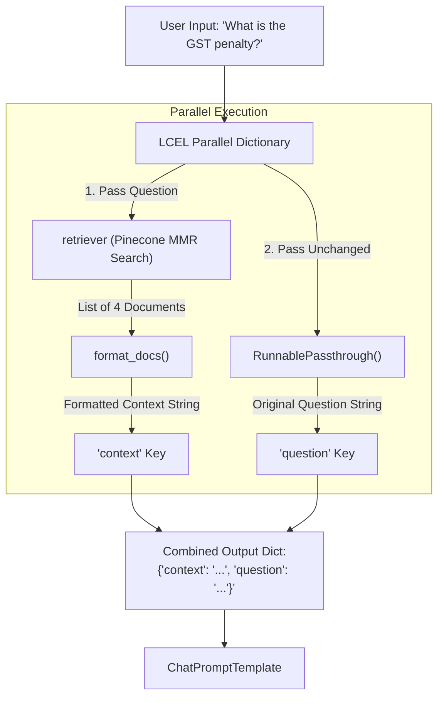

# Beginners Guide: LCEL Parallel Chains & MMR Retrieval Explained

This guide provides a step-by-step, beginner-friendly explanation of two core concepts used in [`02_rag_implementation/rag_lcel.py`](file:///Users/sarthakjain/Desktop/langchain-course/02_rag_implementation/rag_lcel.py):

1. **The LCEL Parallel Dictionary (`RunnablePassthrough` & Pipe Operators)**
2. **MMR (Maximal Marginal Relevance) Retriever Parameters**

---

## Part 1: Deconstructing the LCEL Parallel Dictionary

### The Problem

Your `ChatPromptTemplate` needs **two** variables to fill in its template:

1. `{context}`: The formatted text retrieved from the Pinecone vector database.
2. `{question}`: The user's original query.

However, when you call `chain.invoke("What is the penalty...?")`, you only pass a **single string** (`question`).

---

### The Solution: LCEL Runnable Parallel Dictionary

In LangChain Expression Language (LCEL), when you place a Python dictionary at the start of a chain, LangChain runs all dictionary keys in **parallel** and builds a dictionary output matching the prompt's required input variables:

```python
{
    "context": retriever | format_docs,
    "question": RunnablePassthrough(),
}
```

---

### Data Flow Diagram



---

### Key Breakdown

#### 1. `"question": RunnablePassthrough()`

- **What it does**: `RunnablePassthrough()` takes whatever input comes into the step and passes it through **completely untouched**.
- **Why we need it**: Since the initial input is a string (`"What is the GST penalty?"`), `RunnablePassthrough()` assigns that exact string to the `"question"` key.

#### 2. `"context": retriever | format_docs`

- **What it does**: This uses the **pipe operator (`|`)** to chain two operations together sequentially:
  1. `retriever`: Takes the input question string, searches Pinecone, and returns a list of 4 `Document` objects (`list[Document]`).
  2. `format_docs`: Takes that `list[Document]` and converts it into a single clean markdown string.
- **Result**: The formatted context string is assigned to the `"context"` key.

---

## Part 2: Deconstructing MMR (Maximal Marginal Relevance)

### The Problem with Standard Similarity Search

In standard cosine similarity search, a vector database returns the top `k` chunks with the closest vector distance to your query.

However, legal texts (like the CGST Act) often repeat similar phrasing across multiple consecutive paragraphs. Standard similarity search will return **4 almost identical chunks** from the exact same section!

> ❌ **Standard Search Result**:
>
> - Chunk 1: Section 47(1) late fee rule part A
> - Chunk 2: Section 47(1) late fee rule part A (duplicate overlap)
> - Chunk 3: Section 47(1) late fee rule part B
> - Chunk 4: Section 47(1) late fee rule part B (duplicate overlap)

---

### The Solution: MMR (Maximal Marginal Relevance)

MMR balances **Relevance to the query** with **Diversity among returned results**.

```python
retriever = vectorstore.as_retriever(
    search_type="mmr",
    search_kwargs={
        "k": 4,
        "fetch_k": 20,
        "lambda_mult": 0.7,
    },
)
```

---

### How MMR Works Step-by-Step

```mermaid
graph LR
    Q["User Query"] -->|1. Vector Search| Pool["Candidate Pool<br>(fetch_k = 20 Chunks)"]
    Pool -->|2. MMR Selection & Diversity Filtering<br>(lambda_mult = 0.7)| Selected["Final Diverse Chunks<br>(k = 4 Chunks)"]
```

---

### Parameter Breakdown

| Parameter         | Value | What it Means                  | Practical Impact                                                                                                                                                                      |
| :---------------- | :---- | :----------------------------- | :------------------------------------------------------------------------------------------------------------------------------------------------------------------------------------ |
| **`fetch_k`**     | `20`  | Candidate Pool Size            | First retrieves the top 20 candidate chunks based purely on vector similarity.                                                                                                        |
| **`lambda_mult`** | `0.7` | Relevance vs. Diversity Slider | Controls the balance:<br>• `1.0` = Pure similarity (no diversity)<br>• `0.0` = Maximum diversity (ignores query match)<br>• **`0.7`** = Heavily relevant while discarding duplicates. |
| **`k`**           | `4`   | Final Count                    | Selects the top 4 diverse chunks from the candidate pool to pass to the LLM.                                                                                                          |

> ✅ **MMR Search Result**:
>
> - Chunk 1: Section 47(1) Outward Supply Late Fees
> - Chunk 2: Section 47(2) Annual Return Late Fees
> - Chunk 3: Section 31 Tax Invoice Rules
> - Chunk 4: Section 36 Book Retention Rules (72 months)

---

## Quick Reference Summary

| Expression                 | Purpose                                        | Output Type |
| :------------------------- | :--------------------------------------------- | :---------- |
| `RunnablePassthrough()`    | Passes input data unchanged                    | `str`       |
| `retriever \| format_docs` | Searches Pinecone + stringifies results        | `str`       |
| `search_type="mmr"`        | Activates Maximal Marginal Relevance           | `Retriever` |
| `fetch_k=20`               | Evaluates 20 candidates before picking top `k` | Parameter   |
| `lambda_mult=0.7`          | 70% relevance weight / 30% diversity weight    | Parameter   |
